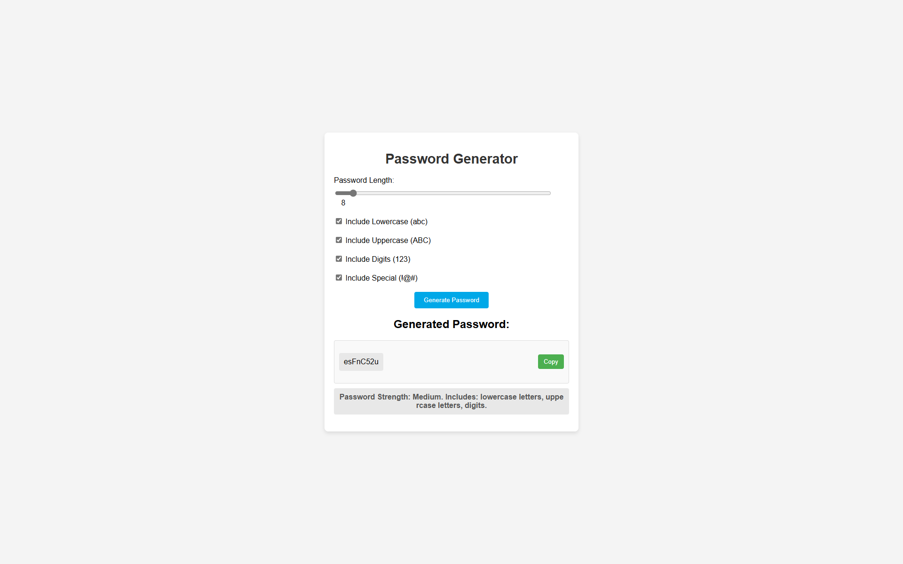

# Password Generator App

This is a modern, responsive password generator web application built with Flask. It allows users to generate passwords based on specified criteria such as length and character types, and provides feedback on the strength of the generated password.

## Features

- **Responsive Design**: Works seamlessly on both desktop and mobile devices.
- **Password Criteria**: Users can specify the length of the password and choose to include lowercase letters, uppercase letters, digits, and special characters.
- **Password Strength Evaluation**: Provides real-time feedback on the strength of the generated password.
- **Copy to Clipboard**: Includes a convenient "Copy" button to easily copy the generated password to the clipboard.

## Getting Started

### Prerequisites

- Python 3.x
- Flask

### Installation

1. Clone the repository:
    ```sh
    git clone https://github.com/yourusername/password-generator-app.git
    cd password-generator-app
    ```

2. Create a virtual environment and activate it:
    ```sh
    python -m venv venv
    source venv/bin/activate  # On Windows use `venv\Scripts\activate`
    ```

3. Install the required packages:
    ```sh
    pip install Flask
    ```

### Running the Application

1. Run the Flask application:
    ```sh
    python app.py
    ```

2. Open your web browser and go to `http://127.0.0.1:5000/` to access the application.

### Usage

1. **Set Password Length**: Use the slider to set the desired length of the password.
2. **Select Character Types**: Check the boxes to include lowercase letters, uppercase letters, digits, and special characters in the password.
3. **Generate Password**: Click the "Generate Password" button to create a password based on the selected criteria.
4. **Copy Password**: Click the "Copy" button to copy the generated password to your clipboard.
5. **View Strength**: Check the strength of the generated password which will be displayed below the password.

## Folder Structure

```
password_generator_app/
│
├── app.py               # Main Flask application file
├── static/
│   ├── styles.css       # CSS file for styling
│   ├── script.js        # JavaScript file for interactivity
└── templates/
    └── index.html       # HTML template for the application
```

## Screenshot



## Contributing

Contributions are welcome! Please fork the repository and create a pull request with your changes.

## License

This project is licensed under the MIT License.

## Contact

For any questions or suggestions, please open an issue or contact the project maintainer at philiptenibas@gmail.com.
